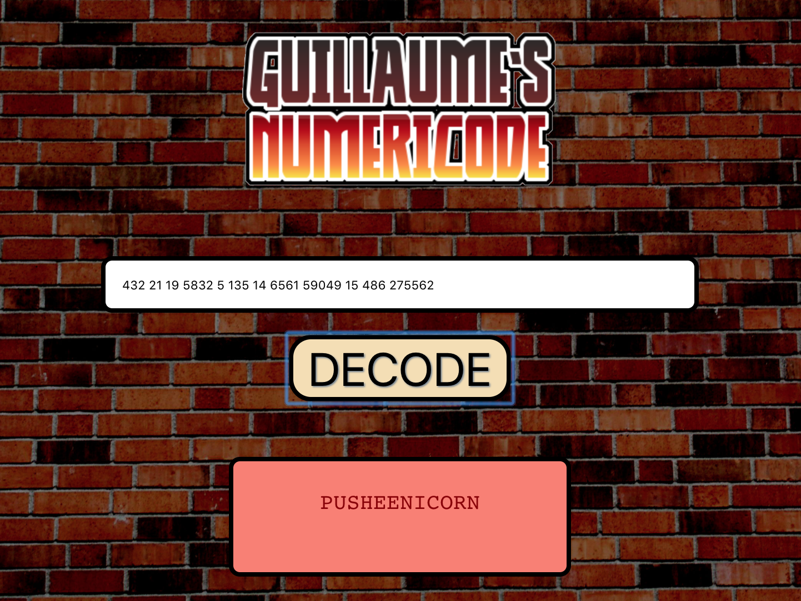
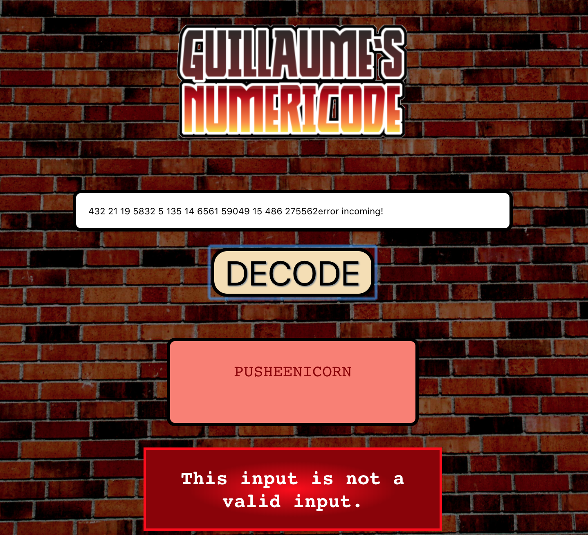

:closed_lock_with_key: Guillaume's numericode :closed_lock_with_key:
===
This is Guillaume's numericode

Main functionalities:
- Numericode is very similar to the numeric substitution cipher (A=1,B=2,...,Y=25,Z=26), except that the numbers given can be larger than 26.
- If a number is 27 or larger, it needs to be divided by 27 multiple times until it is 26 or less:
  - If the remainder is 0, it shows the corresponding letter.
  - If the remainder is not 0, it returns a space.
- It errors if we do the input is invalid.

Technologies used:
----
- JavaScript
- ES6 syntax
- create-react-app
- React
- PropTypes
- classNames
- BEM
- HTML
- CSS
- Flexbox
- React-media
- Jest

Desktop preview:
----






How to run it:
----
Unzip folder and then:
```
cd guillaume-numericode
./build.sh
```

Methodology:
----
- I first scaffolded the app through react-create-app.
- I started with unit logic tests and based the numericode logic on how it is supposed to work.