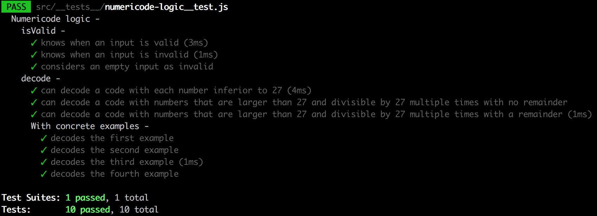

# :closed_lock_with_key: Guillaume's numericode :closed_lock_with_key:

This is Guillaume's numericode

Main functionalities:

- Numericode is very similar to the numeric substitution cipher (A=1,B=2,...,Y=25,Z=26), except that the numbers given can be larger than 26.
- If a number is 27 or larger, it needs to be divided by 27 multiple times until it is 26 or less:
  - If the remainder is 0, it shows the corresponding letter.
  - If the remainder is not 0, it returns a space.
- It errors if we do the input is invalid.

## Technologies used:

- JavaScript
- ES6 syntax
- create-react-app
- React
- PropTypes
- classNames
- BEM
- CSS
- Flexbox
- Jest

## Desktop preview:


## How to run it:

Unzip folder and then:

```
cd guillaume-numericode
npm install
npm test
npm start
```

## Unit tests:



## Methodology:

- I first scaffolded the app through react-create-app.
- I started with unit tests and the app logic.
- I added components and used state to save the latest input.
- I added the latest Numericode input within sessionStorage (since we want it to be saved on refresh only).
- I handled the error display.
- I finalised with some styling.

## What I learnt:

- After getting the following in my test:

```
Expected value to equal: "FOO BAR"
Received: "FOO BAR"
```

and doing my research to solve, I learnt that String.fromCharCode(32) returns white space as opposed to String.fromCharCode(160) that returns a no breaking space. They look the same but they are not the same.

- That typeof parseInt("whatever", 10) or typeof parseInt("\*@&^?", 10) always returns a typeOf number no matter what so had to go a different route and as a result, learnt about...
- The very convenient isNaN() function that determines whether a value is NaN or not
- (not learnt but forgotten and then remembered), that toThrow expects a function as we are not comparing values, which held me a little bit. In the end, I handled the error a different way but it was still a good reminder.
- That Pusheenicorn is actually a thing!
